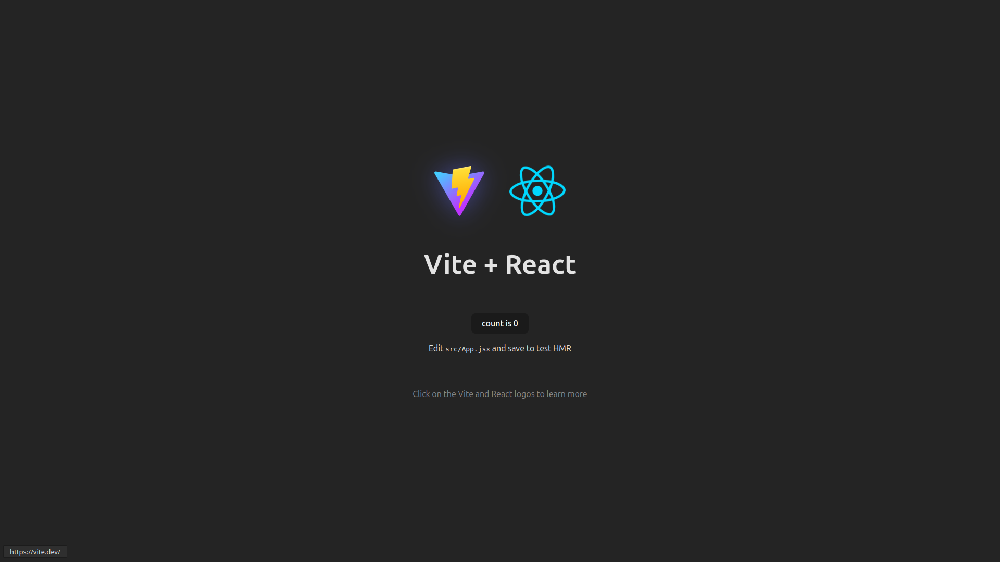

## Setup

### 1. Dependencies

Created app & installed deps using using

```bash
# 1. Create React app with Vite
npm create vite@latest timeline -- --template react
cd timeline

# 2. Install MaterialUI + Icons
npm install @mui/material @emotion/react @emotion/styled @mui/icons-material

# 3. Install GSAP
npm install gsap
```

And quickstarted using `npm run dev` to see:



### 2. Router

I used [ESRouter](../../timeline/core/docs/util/components/ESRouter.md) (a re-usable easy-routing module I developed earlier).

It requires 2 more deps that are installed using:

```bash
npm install react-router-dom notistack
```

I added routes in `routes/index.js`:
```js
const routes = [
  {
    prefix: "/",
    routes: guest_routes,
  },
];
```

And guest_routes in `routes/guest.js`:

```js
const guest_routes = {
  "/": Welcome,
};
```

to see:


Similarly, all other routes shall be added in `routes/` dir.

## Next Up

Now its time to design Timeline parent component and item component(s). for `timeline` (primary) page.