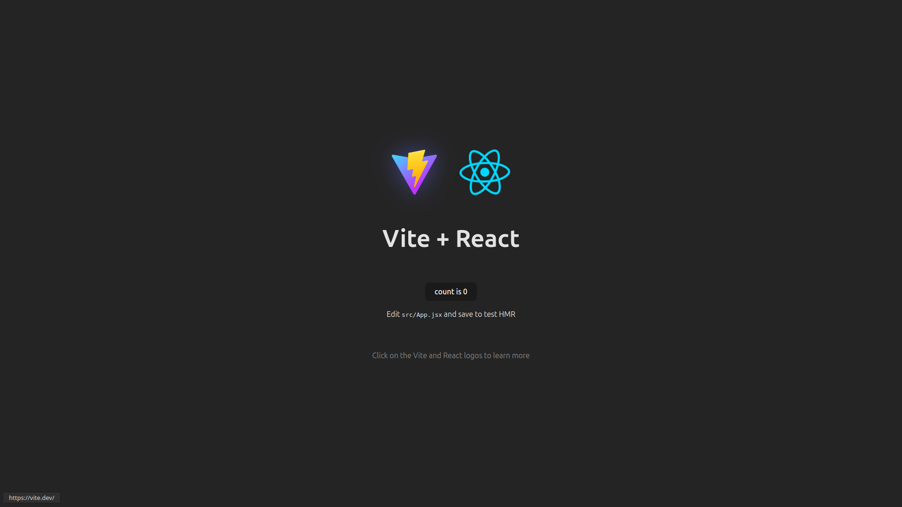
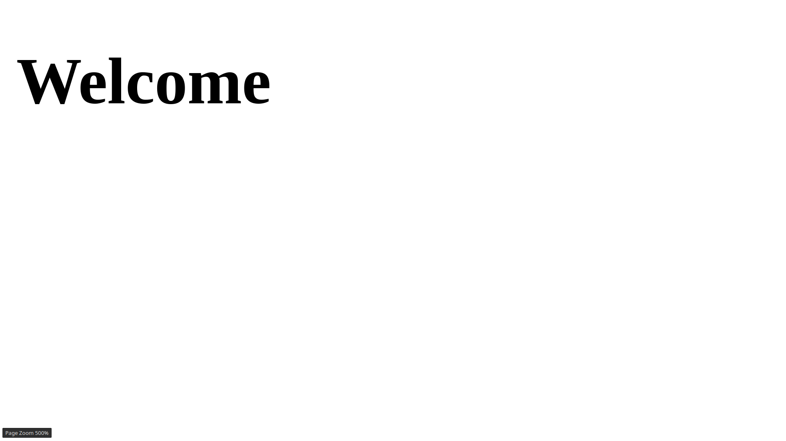
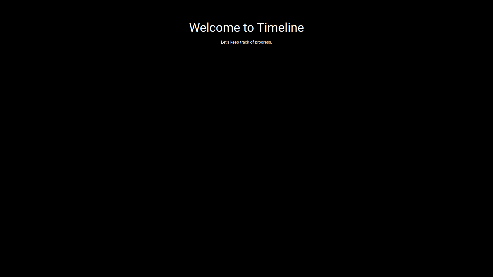

## Setup

### 1. Dependencies

Created app & installed deps using using

```bash
# 1. Create React app with Vite
npm create vite@latest timeline -- --template react
cd timeline

# 2. Install MaterialUI + Icons
npm install @mui/material @emotion/react @emotion/styled @mui/icons-material

# 3. Install GSAP
npm install gsap
```

And quickstarted using `npm run dev` to see:



### 2. Router

I used [ESRouter](../../timeline/core/docs/util/components/ESRouter.md) (a re-usable easy-routing module I developed earlier).

It requires 2 more deps that are installed using:

```bash
npm install react-router-dom notistack
```

I added routes in [`routes/index.js`](../../../project/ui/src/routes/index.js):
```js
const routes = [
  {
    prefix: "/",
    routes: guest_routes,
  },
];
```

And guest_routes in [`routes/guest.js`](../../../project/ui/src/routes/guest.js):

```js
const guest_routes = {
  "/": Welcome,
};
```

to see:



Similarly, all other routes shall be added in `routes/` dir.

### 3. Theme

Created a MUI theme in [`src/theme.js`](../../../project/ui/src/theme.js):
```js
{
  palette: {
    mode: 'dark',
    primary: { main: '#ffffff' },
    background: { default: '#000000', paper: '#000000' },
    text: { primary: '#ffffff', secondary: '#aaaaaa' }
  },
  typography: {
    fontFamily: 'Roboto, sans-serif',
    button: { textTransform: 'none' }
  },
  shape: {
    borderRadius: 0
  }
}
```

Installed font using `npm install @fontsource/roboto` and added in [`src/main.jsx`](../../../project/ui/src/main.jsx)


After updating [Welcome Page](../../../project/ui/src/pages/Welcome/Welcome.jsx) to:

```jsx
<Container sx={{ textAlign: 'center', mt: 10 }}>
  <Typography variant="h3" gutterBottom>
    Welcome to Timeline
  </Typography>
  <Typography variant="body1">
    Let's keep track of progress.
  </Typography>
</Container>
```

result is adorable:



## Next Up

Now its time to design Timeline parent component and item component(s). for `timeline` (primary) page.

Goto: [UI: Timeline Parent Component](2-ui-timeline-parent.md)