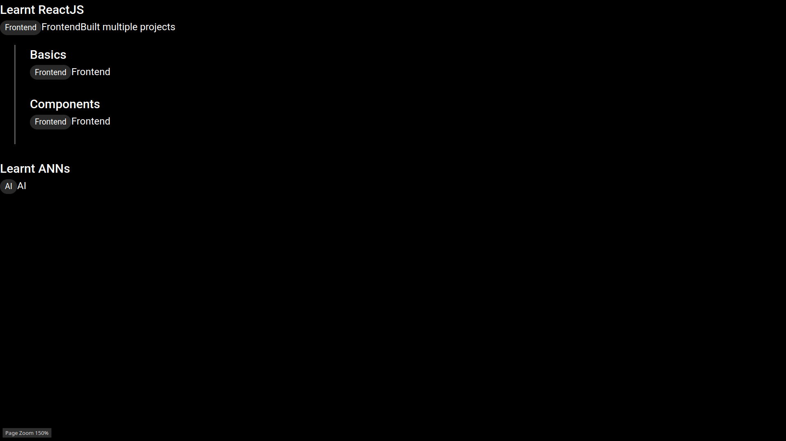

## UI: Timeline Parent Component

To be honest, this timeline component... will be a bit tricky to make. But it will look lovely at end.

### Requirements

For a simple explaination:
- We need to show different items in a vertical stack.
- Like, "Learnt ReactJS" can be an item. "Learnt ANNs" can be another.
- The real twist comes in when "Learnt ReactS" can have child timeline, with items like "Basics", "Components", etc.

From a developer's eye:
- Let's make a single Timeline component
- That will show these items like ReactJS etc.
- But each item can also render the same Timeline component with its own children.
- Cool. Isn't it ? Nah. I don't think it'll be cool while typing some code. But let's get right into it.

### Features

After studying requirements, let's talk some tech-terms:

- Let's make [`src/components/timeline/Timeline.jsx`](../../../project/ui/src/components/timeline/Timeline.jsx)
- It will receive `items` prop (from [`dist/timeline.json`](../../../project/ui/dist/timeline.json))
- `items` can have `{ title, category, type, [desc], [img], [url], [children]}` where `title` and `category` are required.
- `type` prop for each item tells which type of item is it ? (For starter, we shall only use [`ExpandibleAccordionTimelineItem`](../../../project/ui/src/components/timeline/items/ExpandibleAccordionTimelineItem.jsx))
- The `ExpandibleAccordionTimelineItem` itself will import [`Timeline`](../../../project/ui/src/components/timeline/Timeline.jsx) and render at end if `children` is provided in it's prop.

Great plan. Let's write some code ...

### Results

After programming [`Timeline.jsx`](../../../project/ui/src/components/timeline/Timeline.jsx) with:

```js
<Box sx={{ display: 'flex', flexDirection: 'column', gap: 0 }}>
  {items.map((item, idx) => (
    <ExpandibleAccordionTimelineItem key={idx} {...item} />
  ))}
</Box>
```

we can render following results:



using this [`dist/timeline.json`](../../../project/ui/dist/timeline.json):

```json
[
  {
    "title": "Learnt ReactJS",
    "category": "Frontend",
    "desc": "Built multiple projects",
    "children": [
      { "title": "Basics", "category": "Frontend" },
      { "title": "Components", "category": "Frontend" }
    ]
  },
  {
    "title": "Learnt ANNs",
    "category": "AI"
  }
]

```

## Next Up

Here, I used a simple outputs and recursive `Timeline` render in `ExpandibleAccordionTimelineItem`, Let's design the Timeline Item component -- the heart of timeline project.

Goto: [UI: Timeline Item Component](3-ui-timeline-item.md)
