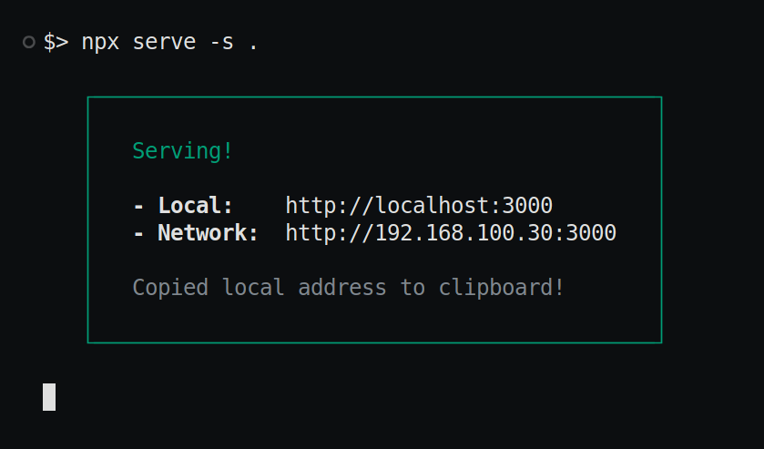

## Phase 1 Usage

#### Step-1: Download

Download phase 1 `build.zip` from [Releases](https://example.com). and unzip. You should see files:


#### Step-2: Run Server

Execute command `npx serve -s .` to start server.



#### Step-3: Add an item to `items.json`

Update file `/items.json` and add first item like:

```json
[
  {
    "id": 1,
    "title": "Basic Frontend Skills",
    "category": "Skillset",
    "categoryColor" : "#ffffff",
    "note": "Learnt Basic Frontend Development Skills",
    "img": "/uploads/images/fe-dev.png",
    "desc": "Studied HTML, CSS, JS, JQuery, Bootstrap3. Practiced in a few projects. And earned a few certificates. Expande below to learn more.",
    "date": "Jul 31, 2019",
    "level": 0
  }
]
```

Reload page, and it displays:


### Step-4: Add a child item to `items.json`

You can add a new item. and add it to parent's children (as an array):

```json
[
  {
    "id": 1,
    // ...
    "children": [2]
  },
  {
    "id": 2,
    "title": "Codex - My First Webpage Task",
    "category": "Task",
    "categoryColor" : "#ffffff",
    "note": "Developed first webpage design.",
    "img": "/uploads/images/codex-first-webpage.png",
    "img_link": "https://youtu.be/3L_ltFz9KNU?si=K-SlXPbl5yXFNnlp",
    "desc": "Made a webpage using HTML, CSS and JS. Watch video for more deails.",
    "date": "24 May 2019",
    "level": 1
  }
]
```

Remember to set level to 1.

Now you can refresh webpage to view result:

<table>
  <tr>
    <th>Children Closed</th>
    <th>Children Open</th>
  </tr>
  <tr>
    <td>
      
    </td>
    <td>
      
    </td>
  </tr>
  <tr>
    <td>Before clicking "+" icon</th>
    <td>After clicking "+" icon</th>
  </tr>

</table>